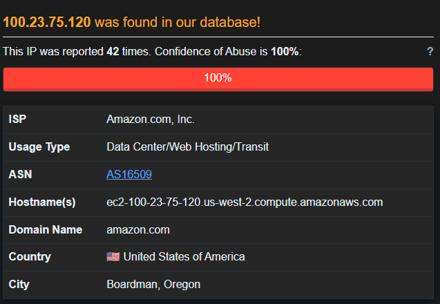
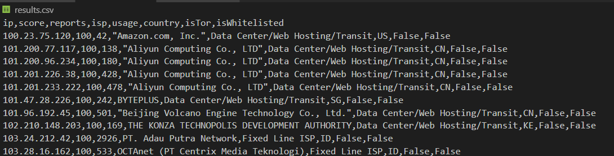
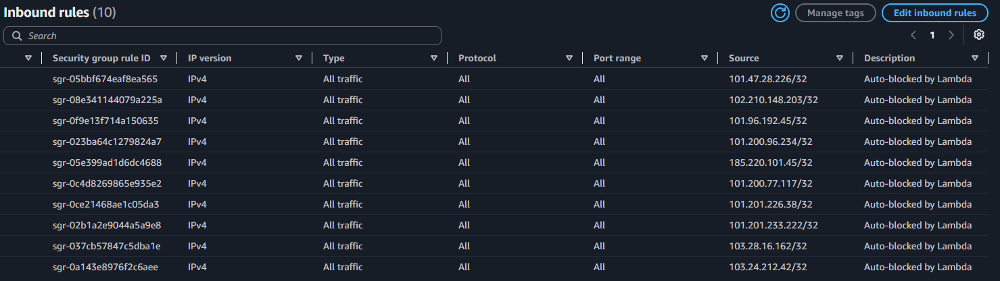
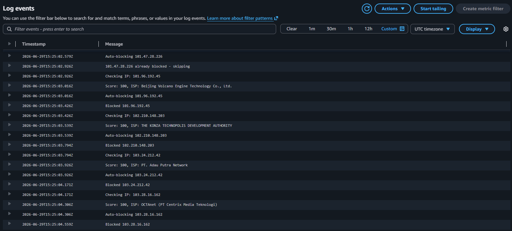

# Threat Intelligence IP Enrichment Pipeline

## What it Does
Automated Python pipeline that queries suspicious IPs against the AbuseIPDB 
threat intelligence API to determine malicious confidence scores, ISP origin, 
geographic location, and Tor node status. Built to extend detection work from 
my AWS security monitoring lab. CloudWatch alerts identify suspicious IPs, 
this pipeline automates the investigation step.

## How it Works
1. Ingest a list of suspicious IPs (I used Emerging Threats compromised blocklist)
2. Query each IP against AbuseIPDB API v2
3. Parse JSON response and extract key threat indicators
4. Output structured results to CSV for analysis

## Tools and Languages
- Python 3
- AbuseIPDB API v2
- Emerging Threats compromised IP blocklist
- Libraries: requests, csv

## Sample Output
| IP | Score | Reports | ISP | Country | isTor |
|---|---|---|---|---|---|
| 100.23.75.120 | 100 | 42 | Amazon.com | US | False |

## Findings
Cross-referenced 10 IPs from the Emerging Threats compromised blocklist against 
AbuseIPDB all 10 returned a confidence score of 100, independently confirming 
malicious classification across two threat intel sources. Looking at the 10 
sources I noticed many operate from data center infrastructure across many 
countries, suggesting automated attack tools being used over human operators.

## Connection to AWS Security Monitoring Lab
This pipeline represents the investigation layer that follows detection. 
Mirroring an automated workflow, CloudWatch would trigger this script on 
suspicious IPs, with high-confidence results (a score over 80) automatically 
blocked via AWS security group rules.

From the Emerging Threats compromised blocklist I noticed the most recent 
addition was actually Amazon AWS. After looking into it I learned that many 
attackers use legitimate cloud infrastructure to attack and evade 
reputation-based blocking. This taught me that the indicators I am analyzing 
cannot always tell the full story and it is better to understand the correlating 
indicators to analyze the whole picture.

## Next Steps
- Lambda automation to auto-block high-confidence IPs via AWS security groups

## Lambda Automation

-Extended the pipeline into AWS with a serverless Lambda function that;
  - Queries each IP against AbuseIPDB automatically
  - Auto block high-confidence threats (score >80) via EC2 security group rules
  - Routes cloud provider IPs (Amazon, Google, Microsoft) to SNS email alerts 
  for manual review in order to avoided blocking legitimate infrastructure 
  - Skips duplicate block attempts gracefully for repeated runs

### Results

- 9 IPs auto-blocked via security group rules
- 1 Amazon AWS IP flagged for manual review via SNS email
- All decisions logged to CloudWatch
  
